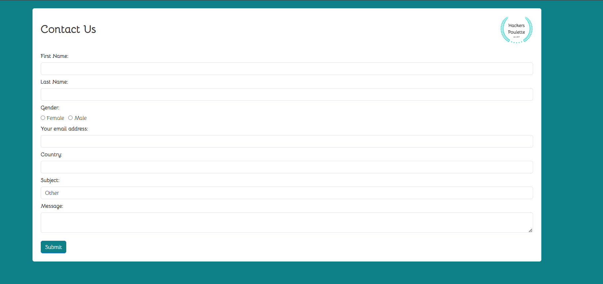
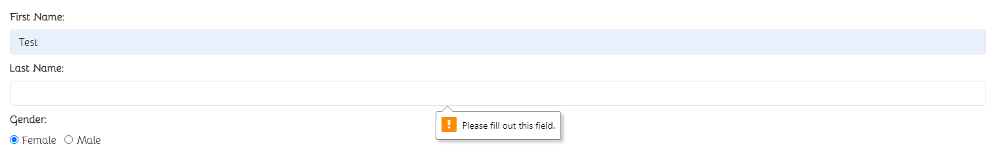
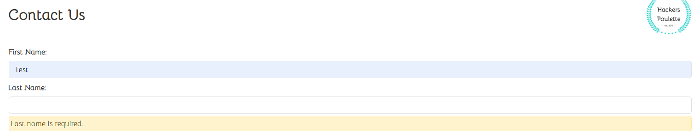

# Hackers Poulette

Solo project.

The company Hackers Poulette ™ sells Raspberry Pi accessory kits to build your own. They want to allow their users to contact their support team. The mission is to create a fully-functioning online "contact support" form, in PHP. It must display a contact form and process the received answer (sanitize, validate, answer the user).

## Features

- Form
- Responsive
- Client side input validation
- Server side input validation
- Honeypot
- Error handling and display
- Sending of mail confirmation to user

## Technologies

- JavaScript
- PHP
- HTML5
- Bootstrap
- [PHPMailer](<url("https://github.com/PHPMailer/PHPMailer")>)

## Screenshots

